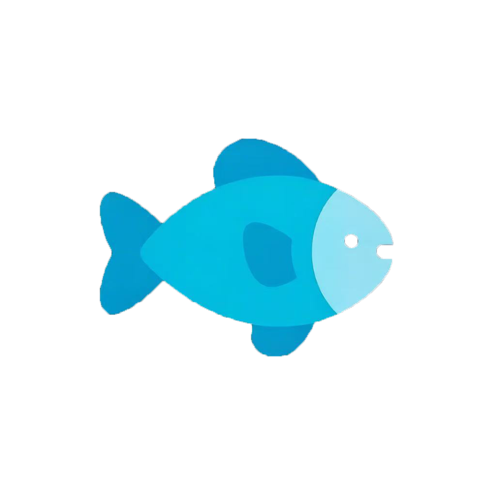

# 博客网站升级记录

## 🎉 升级日期
**2026-03-17** - 首页视觉灵动化升级

---

## ✨ 最新更新（2026-03-17）

### 首页左侧头像区域灵动效果

#### 更新内容
1. **头像图片更新**
   - 替换为 `profile-image.png`（微信图片）
   - 新增 `img-float-wrap` 容器支持独立动画

2. **多层灵动效果**
   - 🌊 **呼吸光晕背景**：蓝色光圈在图片后缓慢放大缩小
   - ✨ **浮动粒子系统**：20 颗蓝色光点从底部向上漂浮
   - 🎬 **图片入场动画**：从模糊下移 → 清晰归位
   - 🌫️ **顶底渐变遮罩**：图片上下边缘与深色背景自然融合
   - 💫 **扫光线效果**：每 6s 从上到下扫过

3. **图片持续漂浮**
   - 8 秒循环漂浮动画
   - 上下 ±14px 轻微游移
   - 轻微缩放变化（1.03 ~ 1.04）
   - 持续循环，永不停止

4. **色调呼吸**
   - 6 秒循环色调变化
   - 亮度和饱和度微变（±7%）
   - 图片有生命感

5. **鼠标视差跟随**
   - 鼠标在左侧移动，图片跟随偏移
   - 最大偏移：X 轴 20px，Y 轴 14px
   - 鼠标移出平滑回弹
   - CSS 变量叠加，不干扰漂浮动画

#### 技术实现

**HTML 结构**
```html
<div class="left-section">
    <div class="left-particles"></div>  <!-- 粒子容器 -->
    <div class="left-scan-line"></div>   <!-- 扫光线 -->
    <div class="profile-image">
        <div class="img-float-wrap">    <!-- 漂浮层 -->
            
        </div>
    </div>
</div>
```

**CSS 关键动画**
```css
/* 漂浮动画（永不暂停） */
@keyframes imgFloat {
    0%   { transform: translate(0px,   0px) scale(1.03); }
    20%  { transform: translate(3px,  -8px) scale(1.04); }
    40%  { transform: translate(0px, -14px) scale(1.035); }
    60%  { transform: translate(-4px, -8px) scale(1.04); }
    80%  { transform: translate(-2px, -3px) scale(1.03); }
    100% { transform: translate(0px,   0px) scale(1.03); }
}

/* 色调呼吸 */
@keyframes imgColor {
    0%,  100% { filter: brightness(1)    saturate(1); }
    33%        { filter: brightness(1.07) saturate(1.15); }
    66%        { filter: brightness(0.95) saturate(0.9); }
}
```

**JavaScript 视差逻辑**
```javascript
// CSS 变量叠加偏移，不暂停 CSS 动画
leftSection.addEventListener('mousemove', function(e) {
    const nx = (e.clientX - rect.left) / rect.width * 2 - 1;
    const ny = (e.clientY - rect.top)  / rect.height * 2 - 1;
    floatWrap.style.setProperty('--mouse-x', `${(nx * 20).toFixed(2)}px`);
    floatWrap.style.setProperty('--mouse-y', `${(ny * 14).toFixed(2)}px`);
});
```

#### 视觉效果层级
```
left-section (深色渐变背景)
  └─ left-particles (z-index: 11) - 浮动粒子层
  └─ left-scan-line  (z-index: 12) - 扫光线
  └─ ::after (z-index: 10) - 呼吸光晕
  └─ profile-image (z-index: 3)
       └─ img-float-wrap (z-index: 内置)
            └─ img (入场 + 色调呼吸)
```

#### 优化要点
- **动画分离**：漂浮、入场、色调三组动画独立，互不冲突
- **永不暂停**：CSS 漂浮动画持续运行，鼠标视差通过 CSS 变量叠加
- **性能优化**：`will-change` 提示浏览器优化，`requestAnimationFrame` 节流鼠标事件
- **z-index 管理**：粒子、光晕、扫光线层级清晰，不遮挡图片

#### 修改文件
- `index.html` - 新增 `img-float-wrap` 容器
- `styles-home.css` - 新增多层动画和 CSS 变量
- `app-home.js` - 视差逻辑改为 CSS 变量叠加
- `profile-image.png` - 新的头像图片

---

## 🎉 升级日期
2026-03-13

---

## ✨ 新增功能

### 1. 关于我页面
- **位置**: 侧边栏"关于我"按钮
- **功能**:
  - 个人头像和昵称展示
  - 个人基本信息（所在地、职业等）
  - 技能标签展示
  - 联系方式
  - 个人简介

### 2. 文章归档功能
- **位置**: 侧边栏"归档"按钮
- **功能**:
  - 按年份自动分组文章
  - 显示每年的文章数量
  - 按时间倒序排列
  - 点击文章直接跳转详情

### 3. 标签云
- **位置**: 侧边栏"标签云"按钮
- **功能**:
  - 展示所有文章标签
  - 按使用频率排序
  - 显示每个标签的文章数量
  - 点击标签自动筛选文章

### 4. 博客详情页增强
- **新增**:
  - 文章分享功能（复制链接、微信、微博）
  - 阅读进度条（顶部显示阅读进度）
  - 更好的排版和视觉体验

### 5. 深色模式
- **位置**: 侧边栏底部主题切换按钮
- **功能**:
  - 一键切换深色/浅色主题
  - 自动保存主题偏好
  - 所有页面元素适配深色模式
  - 平滑过渡动画

### 6. 搜索高亮
- **功能**:
  - 搜索时自动高亮匹配文本
  - 标题、内容、标签均支持高亮
  - 视觉效果友好（渐变背景）

### 7. SEO优化
- **新增元标签**:
  - Description: 网站描述
  - Keywords: 关键词
  - Author: 作者信息
  - Robots: 搜索引擎爬取指令
- **Open Graph标签**:
  - Facebook分享优化
  - Twitter卡片优化
- **Canonical URL**: 规范化URL

### 8. 社交链接
- **位置**: 侧边栏
- **支持**:
  - GitHub链接
  - Email链接
  - 优雅的图标展示

### 9. 个人品牌元素
- **新增**:
  - 博客头像（占位符）
  - 个人标语："记录成长 · 分享生活"
  - 文章总数统计
  - 最后更新时间显示

---

## 🎨 设计改进

### 视觉优化
- 使用CSS变量统一管理颜色主题
- 渐变背景和阴影效果
- 圆角卡片设计
- 平滑过渡动画

### 响应式设计
- 平板端优化（<900px）
- 手机端优化（<600px）
- 侧边栏移动端横向滚动
- 触摸友好的交互

### 色彩方案
- **主色调**: 紫色渐变 (#667eea → #764ba2)
- **浅色模式**: 白色背景，深色文字
- **深色模式**: 深蓝背景，浅色文字

---

## 🔧 技术实现

### HTML更新
- 新增"关于我"弹窗结构
- 新增"标签云"弹窗结构
- 新增"归档"弹窗结构
- 添加社交链接按钮
- 添加主题切换按钮
- 添加SEO meta标签

### CSS更新
- 引入CSS变量系统
- 深色模式样式
- 新增功能模块样式
- 优化响应式断点
- 搜索高亮样式

### JavaScript更新
- 关于我弹窗逻辑
- 标签云生成和筛选
- 归档功能实现
- 主题切换逻辑
- 搜索高亮功能
- 分享功能实现
- 阅读进度条

---

## 📊 功能对比

| 功能 | 升级前 | 升级后 |
|------|--------|--------|
| 个人展示 | ❌ | ✅ |
| 标签云 | ❌ | ✅ |
| 文章归档 | ❌ | ✅ |
| 深色模式 | ❌ | ✅ |
| 搜索高亮 | ❌ | ✅ |
| 文章分享 | ❌ | ✅ |
| 阅读进度 | ❌ | ✅ |
| SEO优化 | 基础 | 完善 |
| 社交链接 | ❌ | ✅ |

---

## 🚀 性能优化

- 使用CSS变量减少重复代码
- 事件委托优化
- 本地缓存主题设置
- 延迟加载优化（按需渲染）

---

## 📝 使用说明

### 如何使用新功能

1. **关于我**: 点击侧边栏"👋 关于我"查看个人信息
2. **归档**: 点击侧边栏"📂 归档"查看按年份归档的文章
3. **标签云**: 点击侧边栏"🏷️ 标签云"查看所有标签并筛选
4. **深色模式**: 点击侧边栏底部的月亮/太阳图标切换主题
5. **搜索**: 在搜索框输入关键词，匹配内容会自动高亮
6. **分享**: 打开文章详情，点击分享按钮选择分享方式

### 如何自定义

#### 修改个人信息
编辑 `index.html` 中的"关于我"弹窗内容：
```html
<div class="about-info">
    <p><strong>昵称：</strong>你的昵称</p>
    <p><strong>所在地：</strong>你的城市</p>
    <p><strong>职业：</strong>你的职业</p>
</div>
```

#### 修改社交链接
编辑 `index.html` 中的 `.social-links` 部分：
```html
<a href="你的GitHub链接" class="social-link" title="GitHub">
    <!-- GitHub图标 -->
</a>
```

#### 修改主题颜色
编辑 `styles.css` 中的 `:root` 变量：
```css
:root {
    --accent-color: #667eea; /* 改成你喜欢的颜色 */
}
```

---

## 🎯 未来改进方向

1. **评论系统**: 集成第三方评论服务（如Disqus、Giscus）
2. **RSS订阅**: 添加RSS feed功能
3. **文章目录**: 长文章自动生成目录
4. **搜索优化**: 添加拼音搜索和模糊匹配
5. **图片懒加载**: 优化图片加载性能
6. **PWA支持**: 支持离线访问
7. **多语言**: 支持中英文切换

---

## 💡 参考案例

本次升级参考了以下优秀个人博客的设计理念：
- **Notion博客**: 清晰的视觉层次
- **Hugo主题**: 深色模式实现
- **Astro博客**: 极简设计和SEO优化
- **Medium**: 阅读进度条设计

---

## 📦 文件清单

修改的文件：
- `index.html` - HTML结构
- `styles.css` - 样式表
- `app.js` - JavaScript逻辑

新增文件：
- `博客网站升级记录.md` - 本文档

---

## 🙏 致谢

感谢所有开源项目和设计灵感的贡献者！
